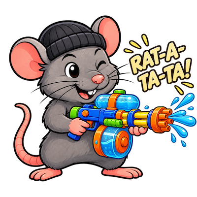

# ratatata



A tiny terminal text editor built with [ratatui](https://github.com/ratatui/ratatui).

Just like [bat](https://github.com/sharkdp/bat) is a modern replacement for cat, rat(atata) aims to be a modern replacement for nano.

- Simple and intuitive to use
- Syntax highlighting
- Nothing to learn or remember
- Full optional mouse control
- No AI features

In short, a simple editor you can use to quickly edit configuration or code files without worrying if your .env secrets are sent to AI or having to remember how vim/emacs works when editing a remote file over ssh.


## Installation

```sh
cargo install ratatata
```

Or from source:

```sh
cargo install --path .
```

Or run in place:

```sh
cargo run -- [path]
```

Installs as the `rat` command (the binary name is set explicitly in `Cargo.toml`, separate from the `ratatata` package name). Requires **Rust 1.90 or later**. Edition 2024 landed in 1.85, but the current dependency tree (`ratatui` 0.30, `image` 0.25, …) needs a newer compiler; `Cargo.toml` also avoids TOML 1.1 multi-line inline tables so an older Cargo is not what blocks the build. Works in any terminal that supports crossterm's event and drawing APIs — including tmux/`screen` when mouse reporting is enabled.

## Features

- **Sidebar + editor split** — browse directories on the left, edit files on the right
- **Clickable shortcut bar** — the keyboard shortcuts are shown as buttons in a bar at the top; click one to run it, hover it for a longer description in the status bar. The keys and the buttons are the same actions, so they always behave identically
- **Catppuccin Mocha UI theme** — semantic application colors supplied by [ratatui-themes](https://crates.io/crates/ratatui-themes), including themed panels, selections, search matches, caret, status bar and shortcut buttons. Truecolor terminals (Ghostty, `COLORTERM=truecolor`, or a `*-direct` terminfo) keep the RGB theme unchanged. Terminals that do not advertise truecolor (for example xfce4-terminal) map the same semantic palette onto ANSI 16; if a colored focus border would be invisible, the focused pane title is reverse/bold instead. There is no theme toggle, and `NO_COLOR` / `FORCE_COLOR` are ignored so a sandbox cannot grayscale Ghostty.
- **Syntax highlighting** — Sublime Text grammars via [syntect](https://github.com/trishume/syntect), detected by extension and first-line heuristics; re-highlights incrementally as you type, only re-parsing lines from the edit point onward
- **Clipboard integration** — copy/cut/paste through the system clipboard ([arboard](https://github.com/1Password/arboard)), with bracketed-paste support for terminals that send it
- **Full mouse support** — click to place the cursor, drag or Shift+click to select, double-click to select a word, triple-click to select a line, Ctrl/Cmd+click a web link to open it in the default browser, scroll wheel to move through text without moving the editor cursor (with a scrollbar) and directories
- **macOS-friendly keys** — on terminals supporting the kitty keyboard protocol, Cmd+key works like Ctrl (unsupported terminals just ignore the request)
- **Incremental search** — Ctrl+F opens a search bar: matches are highlighted as you type, Enter / Shift+Enter step to the next / previous match, Esc closes
- **Find and replace** — Ctrl+Shift+H (or the **replace** shortcut button) extends search: type the find text, Tab or Enter to type the replacement, Enter replaces the current match and steps to the next, Shift+Enter replaces all, Esc closes. Ctrl+H is still hide-dotfiles.
- **Go to line** — Ctrl+G (or the **line** shortcut button) prompts for a 1-based line number and jumps there, keeping the cursor visible. Invalid input is a status message.
- **Toggle sidebar** — Ctrl+B (or the **files** shortcut button) hides or shows the file tree so the editor can use the full width. Directory and selection survive. Ctrl+O while the sidebar is hidden shows it and focuses it.
- **Word wrap** — Ctrl+W wraps long lines at word boundaries (a single unbreakable word still hard-breaks) instead of scrolling horizontally; navigation (arrows, Home/End, PgUp/PgDn, mouse) follows the visual rows, and wrapping re-flows automatically on resize
- **Image previews** — opening an image file (png, jpg, gif, webp, bmp, …) renders it in the editor pane via the terminal's graphics protocol: kitty graphics where supported (kitty, Ghostty, WezTerm, iTerm2, …), unicode half-blocks elsewhere. Images are contained within the pane without clipping; small images remain at native size, while larger images are scaled using logical cell dimensions. Esc closes the preview and restores the previously open text buffer (including word wrap); closing a preview that was the first thing opened lands on empty untitled
- **Hide dotfiles** — the sidebar hides names starting with `.` by default (`..` is always listed). Ctrl+H (or the **hidden** shortcut button) toggles them. Hidden entries are dimmed when shown.
- **Safe file handling** — a dirty buffer blocks opening another file or starting a new one (Ctrl+N), and Ctrl+Q asks for confirmation before discarding unsaved changes
- **Reload from disk** — Ctrl+R re-reads the open file (or the image preview) so external changes show up, and refreshes the sidebar listing in the same go; refused while the buffer has unsaved edits
- **Undo / redo** — Ctrl+Z undoes, Ctrl+Shift+Z redoes; continuous typing, backspacing, deleting and pastes each collapse into a single undo step, and undoing restores the cursor, selection and modified state
- **Unicode-aware editing** — the cursor tracks *characters*, not bytes, so wide characters and non-ASCII text render and edit correctly

## Usage

```sh
rat [path]
rat -h | --help
rat -V | --version
```

| Argument | Behavior |
| --- | --- |
| *(none)* | Browse the current directory |
| `file.txt` | Open the file |
| `image.png` | Preview the image in the editor pane (kitty graphics protocol, unicode half-blocks as fallback; contained and scaled to the pane) |
| `dir/` | Browse the directory |
| `new.txt` (doesn't exist) | Start an untitled buffer bound to that path (created on first save) |
| `-h` / `--help` | Print usage and exit |
| `-V` / `--version` | Print the version and exit |

### Keys

| Keys | Action |
| --- | --- |
| `Ctrl+N` | Start a new untitled buffer |
| `Ctrl+O` | Switch between sidebar and editor (shows the sidebar first if it was hidden) |
| `Ctrl+B` | Show or hide the file sidebar |
| `Ctrl+S` | Save (asks for a name if untitled) |
| `Ctrl+R` | Reload the current file from disk (and refresh the sidebar) |
| `Ctrl+C` / `Ctrl+X` / `Ctrl+V` | Copy / cut / paste |
| `Ctrl+A` | Select all |
| `Ctrl+F` | Search (type to filter, `Enter` / `Shift+Enter` next / previous match, `Esc` closes) |
| `Ctrl+Shift+H` | Find and replace (`Tab` / `Enter` to the replacement field, `Enter` replace current, `Shift+Enter` replace all, `Esc` closes). Does not steal `Ctrl+H`. |
| `Ctrl+G` | Go to line (1-based; invalid input is a status message) |
| `Ctrl+W` | Toggle word wrapping of long lines (visual rows instead of horizontal scrolling) |
| `Ctrl+H` | Show or hide dotfiles in the sidebar (`..` is never hidden; hidden by default) |
| `Ctrl+Z` / `Ctrl+Shift+Z` | Undo / redo |
| `Ctrl+Q` | Quit (press twice when there are unsaved changes) |
| `Esc` | Close an image preview (restores the previous file) / cancel the save-as prompt |

**Sidebar:** `↑`/`↓` select, `Enter`/`→` open (directory = enter, file = open), `Backspace`/`←` go up, `Home`/`End`, `PgUp`/`PgDn` page.

**Editor:** type to insert, `←`/`→`/`↑`/`↓` move (hold `Shift` to extend the selection), `Home`/`End`, `PgUp`/`PgDn`, `Backspace`, `Delete`, `Enter` auto-indents (the new line keeps the current indentation), `Tab` indents (four spaces, or every selected line), `Shift+Tab` dedents. With wrapping on (`Ctrl+W`), `↑`/`↓`/`Home`/`End`/`PgUp`/`PgDn` move by *visual* rows (a wrapped line spans several).

**Mouse:** click the editor to move the cursor, drag or Shift+click to select, double-click selects the word under the cursor, triple-click selects the whole line, Ctrl/Cmd+click an `http://`, `https://`, or `www.` link to open it in the default web browser, scroll to move the viewport without moving the cursor; the editor shows a vertical scrollbar when the content is longer than the viewport. Single-click the sidebar to select, double-click to open, scroll to browse. The shortcut buttons in the bar at the top are clickable too — hover one for a description in the status bar, click it to run the action (the buttons wrap onto a second row on narrow terminals).

## Testing

```sh
cargo test
```

The test suite covers buffer editing, undo/redo coalescing, save/save-as flows, dirty-buffer guards, sidebar navigation and hide/show, mouse interactions, image-preview opening/closing/restoring, unwrapped-line clipping, truecolor vs ANSI-16 palettes, hide-dotfiles listing, find and replace, go-to-line, and headless rendering (including syntax-highlight colors) via ratatui's `TestBackend`.

## How it works

```
src/
├── main.rs       entry point: arg resolution, terminal setup (mouse,
│                 bracketed paste, kitty keyboard protocol, image-protocol
│                 detection), event loop
├── app.rs        application state, key/mouse handling, rendering,
│                 save-as flow, status bar
├── buffer.rs     line-based text buffer with char-indexed cursor,
│                 selection, scrolling, undo/redo, load/save
├── sidebar.rs    scrollable directory listing (dirs first, ".." entry,
│                 optional hide-dotfiles)
├── theme.rs      truecolor detection and ANSI 16 fallback for the UI palette
├── image_view.rs image previews: decode via the `image` crate, render
│                 through the kitty/sixel/iTerm2 protocols (or half-blocks)
│                 via ratatui-image
├── highlight.rs  incremental syntect highlighting with per-line cached
│                 parse states and scope stacks
├── search.rs     case-insensitive incremental search (matches, navigation)
└── clipboard.rs  system clipboard behind a small trait (tests use a fake)
```

Highlighting follows the pattern recommended in syntect's `HighlightState` docs: the parse state and scope stack after each line are cached, so an edit invalidates only the lines from the edit point onward, and they're re-parsed only when they become visible. The syntax definitions and Catppuccin Mocha theme (embedded by [two-face](https://crates.io/crates/two-face)) are loaded once into process-wide statics.
